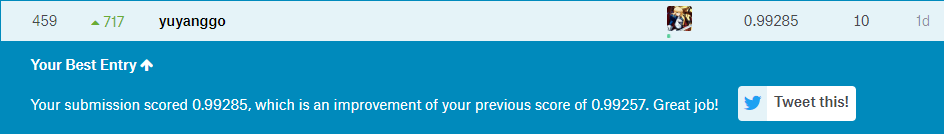

[简介](#简介)

[项目基本思路](#项目基本思路)

[得分进展](#得分进展)

[版本规划](#版本规划)

*   [V1.0](#V1.0)
    *   [起始时间](#起始时间)
    *   [预期目标](预期目标)
    *   [结果](#结果)
    *   [补充](#补充)

[项目思路参考](#项目思路参考)

[涉及知识点](#涉及知识点)

[下一版本规划](#下一版本规划)

# 简介

kaggle入门题目，训练数据已经处理成向量并与标签一一对应，判断测试数据对应的标签。

# 项目基本思路

1. 在solutions中存储不同的解法，在所有解法单独实现完成之后，最终结果采用所有解法的结果来做交叉验证之后的答案，即对于某个向量的预测，采用所有解法中出现次数最多的作为结果。
2. main.py作为项目的入口，所有程序的调用都采用 `python main.py -* *  `的形式来调用，主要是为了统一log等的设置

# 得分进展

1. 2018-03-12 score=0.99285

   keras-原始数据0.5倍缩放之后，采用keras深度学习

2. 2018-03-11 score=0.98542

   svm-将原始数据0.5倍缩放之后，采用pca降维，再使用svm分类

2. 2018-03-08 score=0.97342

   knn-采用0.5倍缩放之后，只设置n_neighbors=3，其余保持默认。

2. 2018-03-03 score=0.96357

   knn-采用二值化之后的数据，n_neighbors=3，algorithm、weights选择默认。

4. 开始前 score=0.96857

   knn-采用原始数据，n_neighbors=3，algorithm、weights选择默认

# 版本规划

## V1.0

### 起始时间

2018-03-07 ~ 2018-03-14

### 预期目标

1.  完成knn、svm、深度学习三种算法的基础解法
2.  得分达到0.99+

### 结果

直接上图吧：

### 补充

鉴于V1版本是第一次开始入门作，存在诸多不完善的地方，因此在代码已经可行的情况，将代码整理放到之后的V2版本。

# 项目思路参考

1. <a href="http://blog.csdn.net/Dinosoft/article/details/50734539">[kaggle实战] Digit Recognizer -- 从KNN,LR,SVM,RF到深度学习</a>

2. <a href="http://blog.csdn.net/firethelife/article/details/51191530">初识Kaggle：手写体数字识别</a>

   ps : 数据二值化之后，采用knn算法

3. <a href="http://blog.csdn.net/buwei0239/article/details/78769985">kaggle-手写字体识别</a>

   ps : 深度学习-keras，达到0.99+

4. <a href="http://blog.csdn.net/laozhaokun/article/details/42749233">Kaggle竞赛题目之——Digit Recognizer</a>

# 涉及知识点

注：参考的博客文章可能在某些地方有一定问题，但大体是正确的，不影响入门学习（刚入门对于细节也不需要那么重视）。

1.  命令行参数设置：

    *   [argparse - 命令行选项与参数解析（译）](http://blog.xiayf.cn/2013/03/30/argparse/)

2.  图像缩放：

    *   [python 读取、保存、二值化、灰度化图片+opencv处理图片的方法](http://blog.csdn.net/JohinieLi/article/details/69389980)
    *   <a href="https://docs.scipy.org/doc/scipy/reference/generated/scipy.misc.imresize.html">scipy.misc.imresize</a>

3.  KNN:

    *   [K近邻法(KNN)原理小结](http://www.cnblogs.com/pinard/p/6061661.html)

    *   [scikit-learn K近邻法类库使用小结](http://www.cnblogs.com/pinard/p/6065607.html)

4.  PCA降维：

    -   [主成分分析（PCA）原理总结](http://www.cnblogs.com/pinard/p/6239403.html)
    -   [用scikit-learn学习主成分分析(PCA)](http://www.cnblogs.com/pinard/p/6243025.html)

5.  感知机：

    [感知机原理小结](http://www.cnblogs.com/pinard/p/6042320.html)

6.  SVM：

    -   [支持向量机原理(一) 线性支持向量机](http://www.cnblogs.com/pinard/p/6097604.html)
    -   [支持向量机原理(二) 线性支持向量机的软间隔最大化模型](http://www.cnblogs.com/pinard/p/6100722.html)
    -   [支持向量机原理(三)线性不可分支持向量机与核函数](http://www.cnblogs.com/pinard/p/6103615.html)
    -   [支持向量机原理(四)SMO算法原理](http://www.cnblogs.com/pinard/p/6111471.html)
    -   [支持向量机原理(五)线性支持回归](http://www.cnblogs.com/pinard/p/6113120.html)
    -   [支持向量机高斯核调参小结](http://www.cnblogs.com/pinard/p/6126077.html)
    -   [scikit-learn 支持向量机算法库使用小结](http://www.cnblogs.com/pinard/p/6117515.html)

7.  keras+TensorFlow：

    安装一定要注意tensorflow、cuda、cudnn的版本要互相匹配。

    -   <a href="http://blog.csdn.net/u013829973/article/details/70555037">window7（64bit）环境下安装基于TensorFlow后端的Keras 教程</a>
    -   <a href="http://blog.csdn.net/u010099080/article/details/53418159">【TensorFlow】Windows10 64 位下安装 TensorFlow - 官方原生支持</a>

    同时注意，keras2.0与之前相比已经有了比较大的变动，具体可看：

    <a href="https://github.com/keras-team/keras/wiki/Keras-2.0-release-notes">Keras 2.0 release notes</a>

    算法：

    -   <a href="https://www.shiyanlou.com/courses/744/labs/2488/document">TensorFlow介绍及简单应用</a>
    -   <a href="https://www.shiyanlou.com/courses/744/labs/2489/document">Keras介绍及手写体数字识别应用</a>
    -   <a href="https://www.shiyanlou.com/courses/744/labs/2491/document">Keras搭建卷积神经网络CNN模型</a>
    -   <a href="http://blog.csdn.net/Dinosoft/article/details/50734539">[kaggle实战] Digit Recognizer -- 从KNN,LR,SVM,RF到深度学习</a>
    -   <a href="http://blog.csdn.net/buwei0239/article/details/78769985">kaggle-手写字体识别</a>

# 下一版本规划

版本号V2.0，3月15日正式启动，至3月31日结束。

-   项目结构重新设计
-   数据分析，进一步减少非必要信息，例如缩放倍率、数据本身的笨些规律等等
-   参数调试。更加细致的参数调试
-   不同结果之间的交叉验证