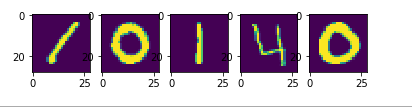
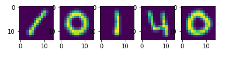

这里的内容为项目成员的日报，内容主要包括成员在项目中做的事情、学到的东西等等。

# 2018-03-08

## @hduyyg

### 0.突破

1.  得分从之前的0.96357到0.97342，提高了整整0.01，说明将图片缩放减少特征的策略是可行的。

### 1.已完成任务

1.  在README中添加整个项目的进度规划

2.  对数据进行缩放：

    经过观察，认为图片应该是28X28的矩阵，如下：

    ~~~ python
    import pandas as pd
    df = pd.read_csv('train.csv',header=0).head()
    df = df.ix[:,'pixel0':]
    %matplotlib inline
    import matplotlib.pyplot as plt
    for i in range(df.shape[0]):
        img = df.ix[i].values.reshape((28,28))
        plt.subplot(2,5,i+1)
        plt.imshow(img)
    ~~~

    

    于是初始默认设置所有图片都缩小0.5倍，代码结果如下：

    ~~~ python
    %matplotlib inline
    import numpy as np
    import matplotlib.pyplot as plt
    from scipy import misc
    data = np.load('train_data.npy')
    labels = np.load('train_label.npy')
    for i in range(10):
        img_matrix = data[i].reshape((28,28))
        img_matrix = misc.imresize(img_matrix, 0.5)
        plt.subplot(2,5,i+1)
        plt.imshow(img_matrix)
    ~~~

    

3.  在get_args.py添加三个新参数：train_data、test_data、train_model

    通过train_data参数结合command参数，来获取训练模型

    通过test_data、train_model参数来获取预测结果

4.  根据参数设计，重构solutions/knn.py

### 2.下一步规划

1.  对于knn模型，对参数进行交叉验证来获取最优模型

    主要验证的参数为：n_neighbors 、weights 、algorithm（根据算法可能还有添加相应的参数） 

2.  完成svm解法的base版本

### 3.随笔

1. <a href="http://blog.csdn.net/dream_angel_z/article/details/47175373">机器学习-训练模型的保存与恢复</a>

2. <a href="http://blog.csdn.net/hanshuobest/article/details/78882425">np.ravel()和np.flatten()</a>

3. kaggle数字识别图片分析参考资料：

   <a href="http://blog.csdn.net/laozhaokun/article/details/42749233">Kaggle竞赛题目之——Digit Recognizer</a>

4. [python 读取、保存、二值化、灰度化图片+opencv处理图片的方法](http://blog.csdn.net/JohinieLi/article/details/69389980)

# 2018-03-04

## @hduyyg

### 1. 已完成任务

1. 完成项目基础结构设计：

   * main.py作为项目入口

     已经实现：

     1. 将命令行参数args传递给python可执行文件的main入口，来运行程序

   * functions.py记录常用函数

     已经实现：

     1. 将预测结果的numpy数组转化为符合题目要求的csv文件并存储在data

   * pre_process.py记录数据预处理函数

     已经实现的预处理包括：

     1. 将csv数据读取并以npy形式存储在data
     2. 将矩阵数值二值化

   * get_args.py读取命令行参数并配置loggging

     参考资料：

     1. [argparse - 命令行选项与参数解析（译）](http://blog.xiayf.cn/2013/03/30/argparse/)

   * daily_report.py记录成员日报

   * solutions文件夹存储solution

   * data文件夹存储所有数据

2. 完成knn的base版本-solutions/knn.py

   采用二值化之后的数据，n_neighbors=3，algorithm、weights选择默认，score=0.96357

### 2.下一步任务计划

1. 设计一个ML分类器的通用框架类，主要功能如下：

   - cross_validate()：交叉验证来确定分类器对应的最佳参数，得到一个最佳分类器
   - get_result():得到测试数据的预测值，用于提交kaggle

2. 将solutions的knn实现改为上述通用框架类的类结构

3. 熟悉、了解sklear.neighbors中的knn分类器、knn回归等

   - 学习knn算法的KdTree实现原理

     参考资料：<a href="http://www.cnblogs.com/pinard/p/6061661.html">[K近邻法(KNN)原理小结](http://www.cnblogs.com/pinard/p/6061661.html)</a>

   - 学习knn算法的BallTree实现原理

     - 参考资料：<a href="http://www.cnblogs.com/pinard/p/6061661.html">[K近邻法(KNN)原理小结](http://www.cnblogs.com/pinard/p/6061661.html)</a>

### 3.随笔

1. KNN分类器使用说明：

   * [官方文档](http://scikit-learn.org/stable/modules/generated/sklearn.neighbors.KNeighborsClassifier.html)
   * [scikit-learn K近邻法类库使用小结](http://www.cnblogs.com/pinard/p/6065607.html)
2. [机器学习中的归一化方法](http://blog.csdn.net/dulingtingzi/article/details/51365545)